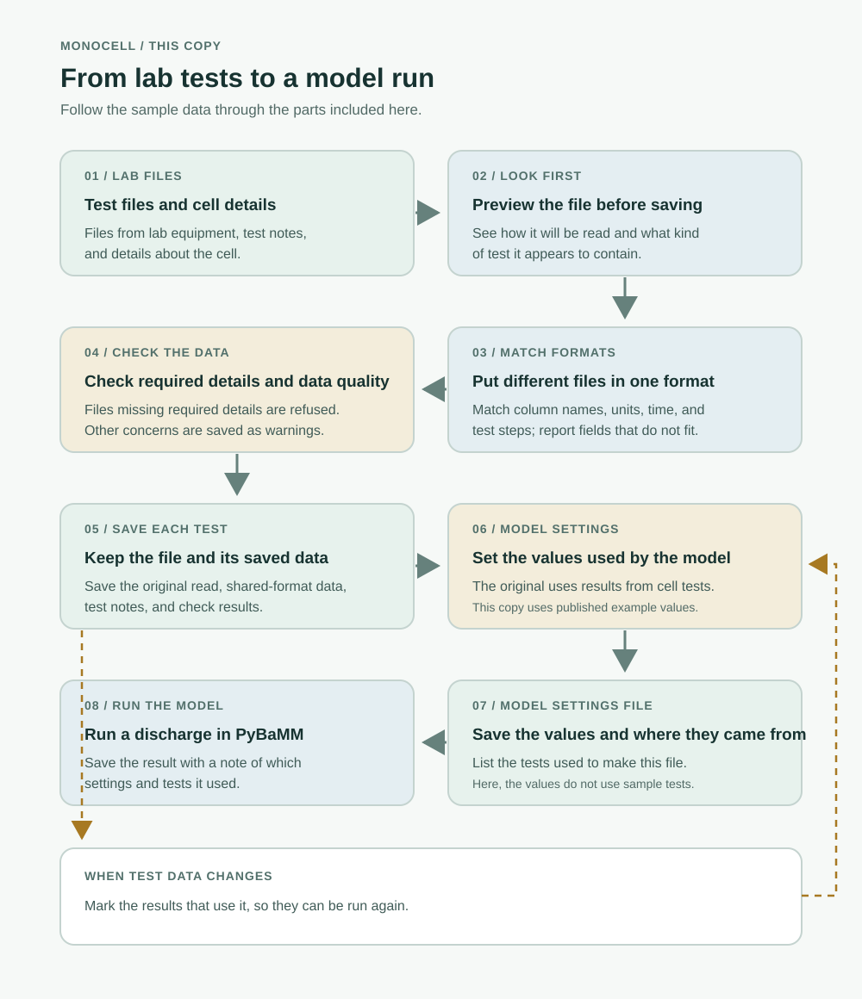
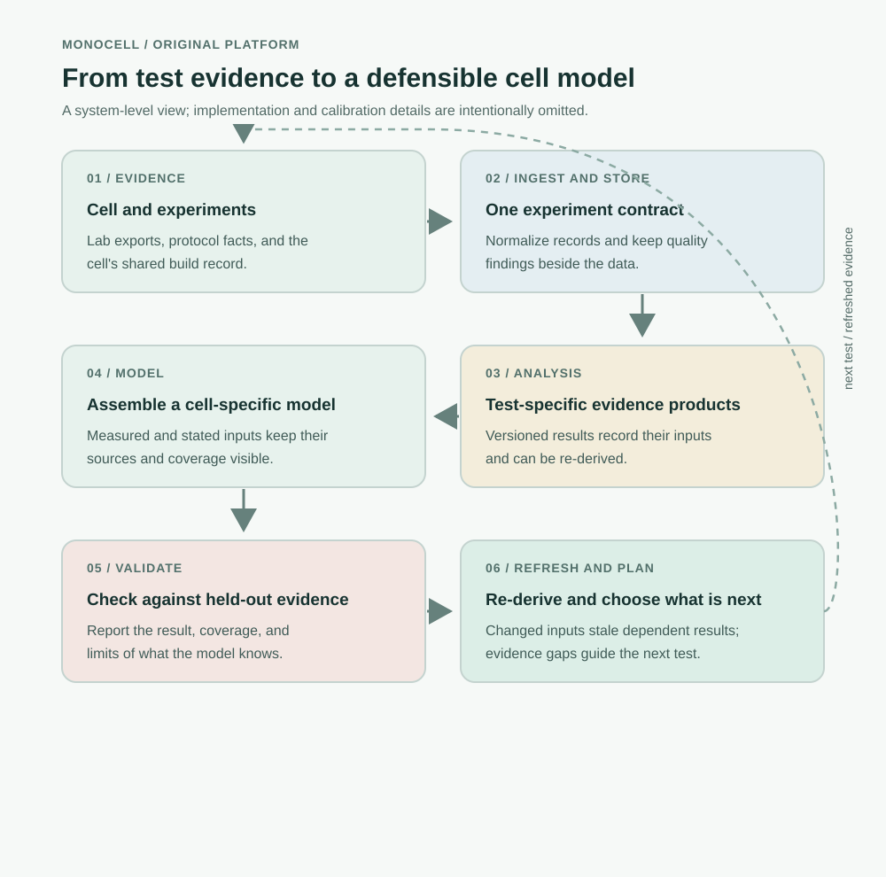
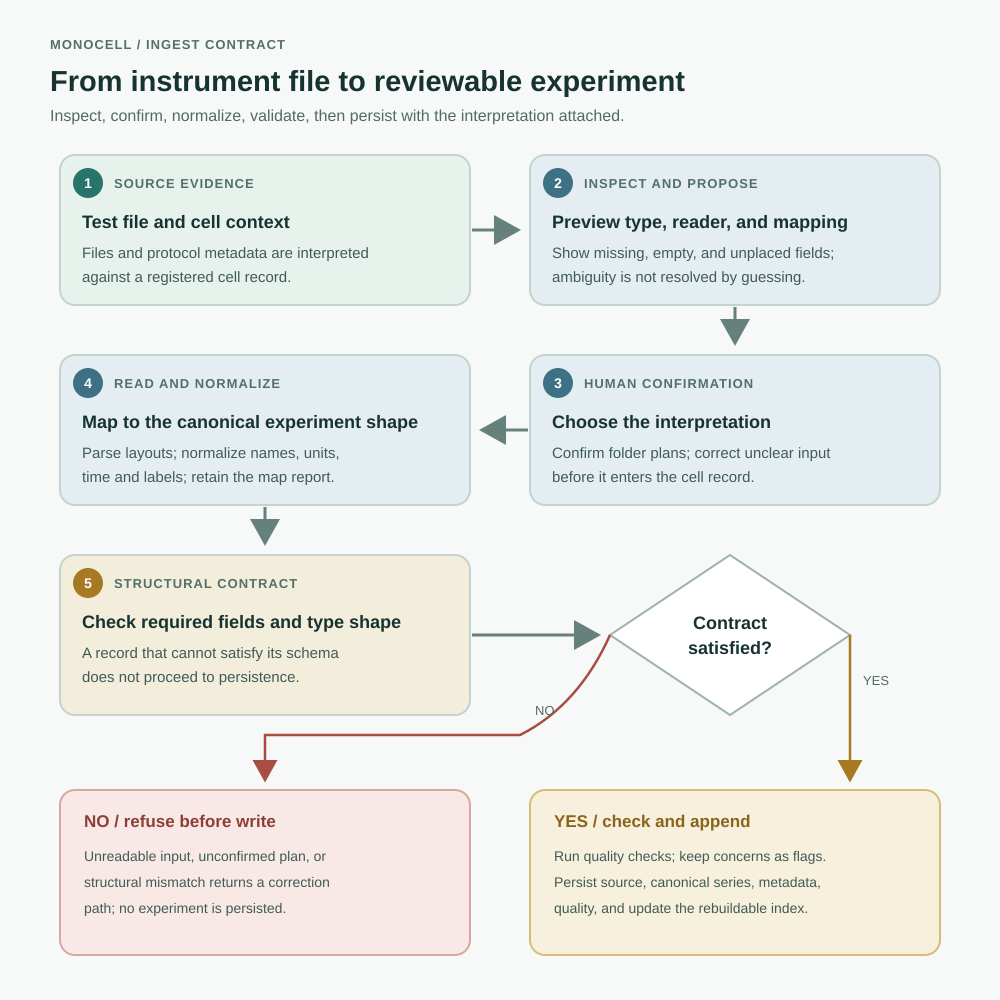
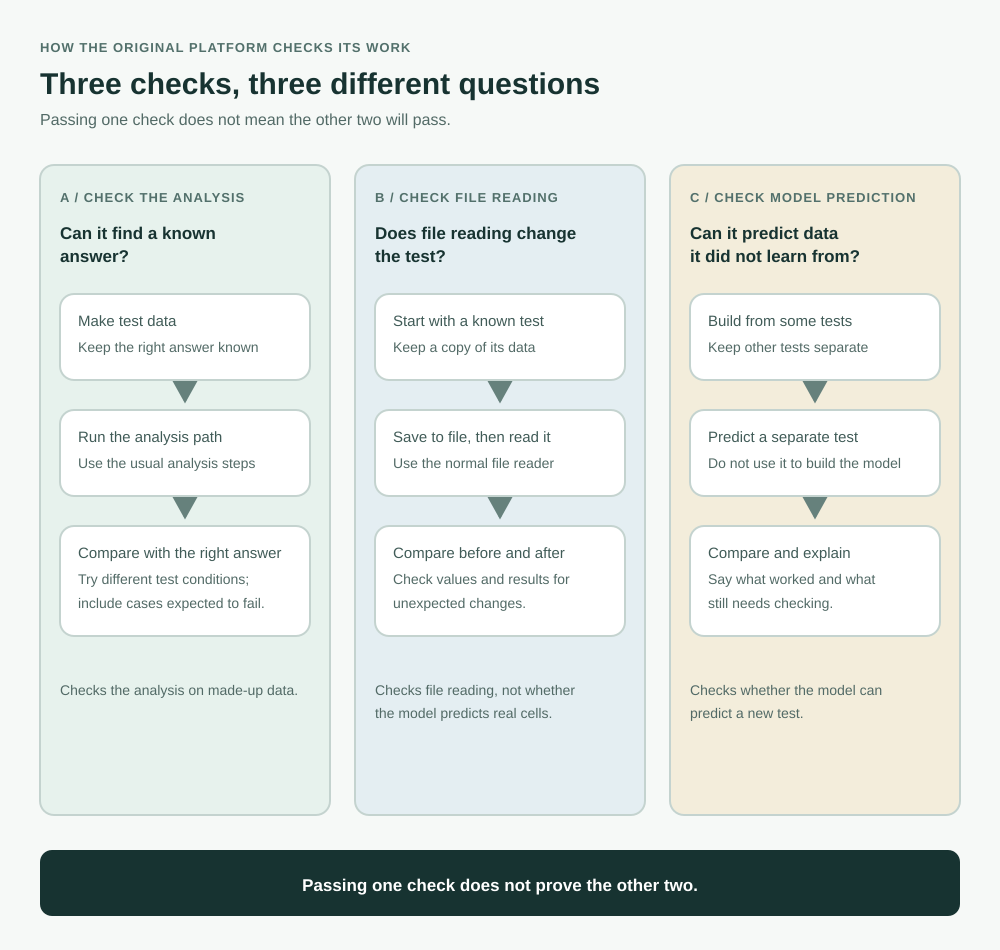

# monocell

Battery test files often come from different machines, with different column
names, units, and extra information. monocell reads those files into a shared
format, checks them, and saves each test with the details needed to understand
it later. The saved tests can then be used to create a parameter file and run a
cell model in PyBaMM. When data changes or a test is withdrawn, monocell marks
the results that may need to be run again.

> **The model-building step is not included in this review copy.** The original
> platform uses the test data to build a set of cell parameters and records
> where they came from. Here, `monocell/engine/extract.py` returns published
> Chen2020 values instead. Those values do not come from the sample tests, so
> the simulation shows how the hand-off works, not a model fitted to this cell.

This repository is shared for review only. See [LICENSE](LICENSE).

> Interviewer guide: [how the original platform works, how files are added, and what this copy demonstrates](docs/interview-guide.md).

## Pipeline

This is the runnable path in this copy: start with lab files, check and save
them, then pass a parameter file to PyBaMM. The model-building box is where
this copy differs from the original platform, as noted above. Select the image
to open a larger version.

[](docs/assets/pipeline.svg)

## How the platform works

The next picture shows the larger original platform. It includes steps that
are not part of this review copy: test-specific analysis, building a model from
the test results, checking that model against separate measurements, and
choosing what test to run next.

[](docs/assets/original-platform.svg)

### Adding a test file

This is the part you can explore in this copy. The numbered steps match the
readers and checks in [the ingest code](monocell/schema/ingest.py), the rig
profiles in [the instrument code](monocell/schema/instruments.py), and the
shared rules in [the experiment schema](monocell/schema/tables.py). Missing
required data stops a save; a quality concern on otherwise usable data is saved
as a warning with the test.

[](docs/assets/ingest-layer.svg)

### How the checks differ

The original platform uses three different checks for three different
questions. Made-up data with a known answer checks whether an analysis can
recover that answer. Exporting and re-reading a test checks whether file
handling changed it. Finally, measurements kept out of model building check
whether the model can predict a new result. Success at one does not prove the
other two.

[](docs/assets/evidence-validation.svg)

## What is here

| Part | Where | What it does |
|---|---|---|
| File readers | `monocell/schema/ingest.py` | Read common cycler, EIS, GITT, and pressure files, plus files not yet matched to a test type |
| Instrument profiles | `monocell/schema/instruments.py` | Translate supported rig column names, units, and step labels into the shared format |
| Test suggestions | `monocell/schema/shapes.py` | Suggest a test type from the data and show why; a person still makes the choice |
| Shared format | `monocell/schema/tables.py` | Set the columns and background details each test type must provide |
| Checks | `monocell/schema/quality.py` | Look for data issues and save findings with the test |
| Saved records | `monocell/schema/write_experiment.py`, `manifest.py`, `artifacts.py` | Keep tests and results without overwriting earlier records; build a searchable index that can be recreated |
| Refreshing results | `monocell/rederive.py`, `monocell/autofit.py` | Find results affected by changed data and run the needed steps again |
| PyBaMM link | `monocell/simulate.py` | Pass parameters to PyBaMM and run a discharge simulation |
| Command line | `monocell/cli.py` | Commands to register cells, inspect and add data, search records, refresh results, and simulate |

| Not included here | Where | What the original does |
|---|---|---|
| Build model settings from test data | `monocell/engine/extract.py` | The original uses cell tests to set model values. This copy uses published example values instead. |

## Quickstart

Python 3.11 or later.

```bash
python -m venv .venv
```

Activate the environment, then install the package with its test and notebook
extras:

```bash
pip install -e ".[test,notebook]"
```

The sample campaign in `examples/lab_exports/` is synthetic data for a 5 Ah
NMC811/graphite cell. `examples/lab_exports/INGEST.md` loads all of it from the
command line. From `examples/`, the commands below create a sample cell, add
its test files, update results, and run a discharge simulation:

```bash
monocell cell register --cell demo --capacity-Ah 5.0 --chemistry "NMC811/graphite" --data-root demo_store
monocell ingest --cell demo --dir lab_exports/cycler --data-root demo_store --confirm
monocell rederive --cell demo --data-root demo_store
monocell simulate --cell demo --c-rate 1 --data-root demo_store
```

The model settings in this copy come from published example values, not from
the sample tests.

`examples/walkthrough.ipynb` goes through the same steps in Python, with the
stored records, the checks and the PyBaMM result shown along the way.

## Design notes

- **Different machines, one shared format.** Readers translate each rig's
  column names and units into the same set of fields. To add a rig, add or
  adjust its profile in `monocell/schema/instruments.py`.
- **The software suggests; a person chooses.** It shows which file reader and
  test type seem to fit. The person checks that choice before a folder is saved.
- **Warnings stay with the test.** A file missing required information is not
  saved as that test type. Other check results are saved beside the data.
- **Saved tests are not overwritten.** A correction is saved as a new test
  linked to the earlier one. A withdrawn test stays on disk with a reason.
- **Changed data can update its results.** Each result remembers which tests it
  used. When one changes or is withdrawn, `monocell rederive` runs the affected
  steps again.
- **The search list can be rebuilt.** `monocell manifest rebuild` recreates it
  from the files in the store.
- **PyBaMM is only needed to run a model.** Reading files and searching the
  store do not need to load PyBaMM.

## Layout

```
monocell/
  schema/        readers, instrument profiles, type proposal, specs, checks,
                 experiment store, manifest, artifacts
  engine/        parameter extraction (abstracted)
  cells.py       build records
  batches.py     lots and their member cells
  rederive.py    staleness and re-derivation
  autofit.py     derive-on-ingest
  simulate.py    PyBaMM bridge
  cli.py         command line
  journal.py     activity log
examples/
  lab_exports/   sample campaign: cycler/, eis/, pressure/, INGEST.md
  walkthrough.ipynb
tests/
```

## Tests

```bash
pytest -n 4
```

The suite runs on the sample campaign and on small frames built inside the
tests. `pytest -m "not slow"` skips the PyBaMM solves.
